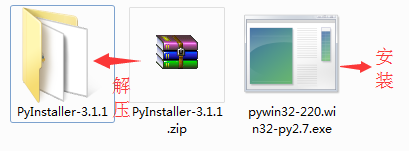

# py2exe
python程序 ==> exe可执行文件 纯净版转换器（自动删除多余文件，只保留最后转换好的exe文件）

## 简介
该程序是对 PyInstaller 简单封装，在这之上删除生成过程中多余的文件夹、文件
  
干净的把python程序转换为exe可执行文件。

exe可执行文件可在没有安装python的windows环境中运行。

使用也很简单，把带转换python文件拖到转换器上，松手，等待运行完毕即可。  
同级目录下会多出一个同名的exe文件。

## 如何使用
### step 1：下载项目
`git clone https://github.com/windcode/py2exe.git`

### step 2：解压PyInstaller，安装pywin32

### step 3：将待转换.py文件拖到py2exe.py转换器上，等待

转换完成，会在当前目录多出一个转换文件的同名exe可执行文件，把这个文件拷走就可以在没有python环境的pc上运行了。

## 注意
* 运行环境为 **windows7 + python2.7**
* 解压 PyInstaller-3.1.1.zip 时选择 **解压到当前文件夹**
